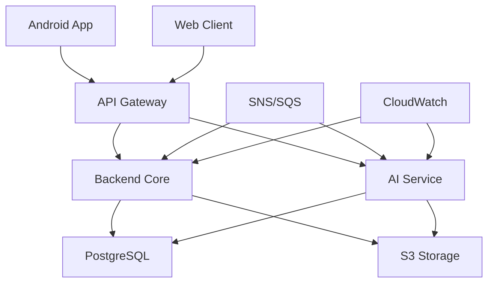

# SmarTrip: Plataforma de Conexión Social y Recomendaciones IA para Viajeros

## Integrantes
- Andrés Felipe Calderón Ramírez - [AndresFelipeCalderonRamirez](https://github.com/AndresFelipeCalderonRamirez)
- Laura Natalia Perilla Quintero - [Lanapequin](https://github.com/Lanapequin)
- Ricardo Andres Ayala Garzon - [lRicardol](https://github.com/lRicardol)
- Santiago Amaya Zapata - [SantiagoAmaya21](https://github.com/SantiagoAmaya21)
- Santiago Botero Garcia - [LePeanutButter](https://github.com/LePeanutButter)

---

## 1. Visión General

SmarTrip es una **plataforma social de turismo inteligente** que revoluciona la forma en que los viajeros se conectan entre sí y descubren experiencias auténticas mediante **Inteligencia Artificial avanzada y matching social**.

### Qué es la plataforma

Un ecosistema digital centrado en:

- **Asistente IA Personalizado**: Companion inteligente que aprende y adapta recomendaciones
- **Conexiones Sociales Inteligentes**: Sistema de matching entre viajeros compatibles
- **Planificación Colaborativa**: Herramientas para crear itinerarios compartidos
- **Descubrimiento Contextual**: Recomendaciones basadas en ubicación, preferencias y comportamiento

### Problema que resuelve

El turismo actual enfrenta desafíos fundamentales:

- **Soledad del viajero**: Dificultad para encontrar compañeros de viaje con intereses similares
- **Recomendaciones genéricas**: Falta de personalización real basada en comportamiento y contexto
- **Fragmentación social**: Ausencia de plataformas que integren conexión humana con tecnología
- **Desconexión cultural**: Barreras para integrarse con comunidades locales y otros viajeros

La plataforma responde a la **necesidad creciente de viajes significativos y conexiones humanas auténticas** en la era digital.

### Valor principal para usuarios y empresas

**Para viajeros**

- **Conexiones significativas**: Encuentra viajeros con intereses, destinos y fechas compatibles
- **Recomendaciones hiper-personalizadas**: IA que aprende tu estilo único de viajar
- **Experiencias colaborativas**: Planifica y comparte itinerarios con nuevos amigos
- **Comunidad global**: Acceso a una red de viajeros con mentalidad similar

**Para empresas turísticas**

- **Inteligencia de mercado profunda**: Insights sobre comportamiento y preferencias reales
- **Segmentación predictiva**: Anticipación de demanda basada en IA y datos sociales
- **Conexión con viajeros cualificados**: Acceso a perfiles detallados para ofertas personalizadas

---

# 2. Diferenciador del Producto

El núcleo de la plataforma es el **Sistema de Matching Social Inteligente impulsado por IA** que combina conexión humana con personalización tecnológica.

Este sistema actúa como un **ecosistema inteligente de conexiones** que transforma la experiencia de viaje de individual a colaborativa.

### Funciones del sistema

- **Análisis Predictivo**: Evalúa compatibilidad entre viajeros basada en múltiples dimensiones
- **Matching Contextual**: Conecta personas según destino, fechas, intereses y comportamiento
- **Aprendizaje Continuo**: La IA mejora con cada interacción y conexión exitosa
- **Social Intelligence**: Analiza patrones de conexión para optimizar recomendaciones
- **Red de Confianza**: Construye reputación basada en experiencias compartidas verificadas

### Experiencia durante todo el viaje

**Antes del viaje**

- **Descubrimiento Social**: Encuentra viajeros compatibles para tu próximo destino
- **Planificación Colaborativa**: Co-crea itinerarios con tus nuevas conexiones
- **IA de Inspiración**: Recibe sugerencias basadas en tu perfil y conexiones

**Durante el viaje**

- **Conexiones en Tiempo Real**: Notificaciones de viajeros cercanos y compatibles
- **Experiencias Compartidas**: Coordina actividades y momentos con tu red
- **Asistente Contextual**: Recomendaciones basadas en ubicación y preferencias grupales

**Después del viaje**

- **Memoria Colaborativa**: Álbumes compartidos y testimonios conjuntos
- **Red Ampliada**: Mantén conexiones para futuras aventuras
- **Inteligencia Acumulada**: El sistema aprende de tus experiencias para mejorar futuras conexiones

---

# 3. Capacidades Clave del Sistema

| Capacidad                          | Descripción                                                                 |
| ---------------------------------- | --------------------------------------------------------------------------- |
| **Matching Social Inteligente**     | Algoritmos de IA que conectan viajeros con alta compatibilidad                |
| **Recomendaciones Contextuales**    | Sugiere experiencias basadas en ubicación, tiempo y preferencias grupales    |
| **Planificación Colaborativa**      | Herramientas para co-crear itinerarios con conexiones compatibles            |
| **Social Intelligence**             | Análisis de patrones de comportamiento para optimizar conexiones              |
| **Aprendizaje Adaptativo**          | Sistema que mejora con cada interacción y conexión exitosa                    |

---

# 4. Sistema de Conexión Social

La plataforma revoluciona la experiencia de viaje mediante su **motor de matching social inteligente** que crea conexiones significativas entre viajeros.

### Algoritmos de Matching

El sistema evalúa múltiples dimensiones de compatibilidad:

- **Proximidad y Destino**: Viajeros en mismos lugares o con itinerarios similares
- **Sincronización Temporal**: Compatibilidad de fechas y horarios de actividades
- **Alineación de Intereses**: Matching basado en preferencias de viaje y estilo
- **Compatibilidad Social**: Análisis de personalidades y comportamientos compatibles
- **Historial de Conexiones**: Aprendizaje de conexiones previas exitosas

### Tipos de Conexiones

**Conexiones Instantáneas**
- Viajeros actualmente en el mismo destino
- Disponibilidad inmediata para actividades
- Matching basado en ubicación en tiempo real

**Conexiones Planificadas**
- Viajeros futuros a los mismos destinos
- Coordinación previa de itinerarios
- Planificación colaborativa de experiencias

**Conexiones por Intereses**
- Comunidades temáticas (aventura, cultural, gastronómico)
- Grupos por estilo de viaje (backpacker, lujo, sostenible)
- Redes de afinidad profesional (nómadas digitales, estudiantes)

### Características Sociales

- **Mensajería Integrada**: Chat seguro dentro de la plataforma
- **Sistema de Reputación**: Validación social basada en experiencias compartidas
- **Verificación de Identidad**: Seguridad y confianza en conexiones
- **Analytics de Compatibilidad**: Insights sobre qué funciona en cada conexión

### Beneficios del Sistema

- **Red Global**: Acceso a viajeros compatibles worldwide
- **Seguridad**: Conexiones verificadas y sistema de reputación
- **Eficiencia**: Ahorro de tiempo en encontrar compañeros compatibles
- **Calidad**: Matching inteligente reduce incompatibilidades
- **Crecimiento**: Red expande con cada nuevo usuario y conexión

---

# 5. Inteligencia de Negocio y Analytics

La plataforma genera **inteligencia predictiva profunda** para el sector turístico mediante análisis de datos sociales y comportamentales.

| Funcionalidad                          | Beneficio Estratégico                                      |
| ------------------------------------- | --------------------------------------------------------- |
| **Social Analytics Dashboard**          | Visualización de patrones de conexión y comportamiento      |
| **Predictive Demand Intelligence**      | Anticipación de tendencias basada en datos sociales        |
| **Audience Segmentation 360°**        | Perfiles detallados para campañas hiper-personalizadas     |
| **Competitive Intelligence**           | Análisis de posicionamiento y oportunidades de mercado      |
| **Experience Optimization Insights**    | Recomendaciones para mejorar servicios basadas en datos     |

### Datos Analizados

**Comportamiento Social**
- Patrones de conexión entre viajeros
- Formación de grupos y comunidades
- Tasas de éxito de matching por destino
- Influencia social en decisiones de viaje

**Preferencias y Tendencias**
- Destinos emergentes por segmentos demográficos
- Actividades con mayor conexión social
- Temporalidad de viajes por tipo de viajero
- Correlación entre intereses y destinos

**Inteligencia Predictiva**
- Demanda futura por destino y temporada
- Potencial de conexión para nuevas rutas
- Identificación de micro-tendencias emergentes
- Optimización de oferta basada en comportamiento social

### Impacto para Empresas

**Decisiones Estratégicas**
- Inversión informada en nuevos destinos
- Desarrollo de productos basados en demanda real
- Optimización de inventario y capacidad

**Marketing y Ventas**
- Segmentación ultra-precisa para campañas
- Personalización de ofertas a nivel individual
- Identificación de embajadores de marca potenciales

**Operaciones**
- Mejora de servicios basada en feedback social
- Optimización de recursos según patrones de demanda
- Desarrollo de experiencias compartidas exitosas

---

# 6. Arquitectura Técnica y Componentes

## Ecosistema Multi-plataforma

| Componente | Tecnología | Propósito |
| ----------- | ---------- | --------- |
| **Aplicación Móvil** | Kotlin + Jetpack Compose | Experiencia nativa Android con Clean Architecture |
| **Backend Core** | Java 17 + Spring Boot 3.2 | API RESTful con JWT, PostgreSQL y microservicios |
| **Plataforma Web** | React 18 + Vite | Dashboard de gestión y planificación detallada |
| **Servicio IA** | Python + FastAPI | Motor de recomendaciones y matching social |
| **Infraestructura** | AWS Academy | Cloud computing con auto-scaling y monitoring |

## Arquitectura Detallada

### Backend Core (Spring Boot)
- **Clean Architecture**: Separación de capas con Controller/Service/Repository
- **JWT Authentication**: Seguridad stateless con refresh tokens
- **PostgreSQL**: Base de datos relacional con JPA/Hibernate
- **REST API Level 3**: HATEOAS y documentación Swagger/OpenAPI
- **Microservicios**: Desacoplamiento con API Gateway y message queues

### Aplicación Móvil (Kotlin)
- **MVVM + Clean Architecture**: Separación de UI, domain y data layers
- **Jetpack Compose**: UI moderna con Material Design 3
- **Room Database**: Caching local para offline support
- **Retrofit + OkHttp**: Cliente HTTP con interceptores
- **Hilt DI**: Inyección de dependencias compile-time

### Plataforma Web (React)
- **React 18 + Hooks**: Componentes funcionales con state management
- **Context API**: Estado global compartido entre componentes
- **CSS Variables**: Theming con dark/light mode
- **Responsive Design**: Mobile-first approach
- **Axios + JWT**: Cliente HTTP con autenticación automática

### Servicio IA (Python)
- **Machine Learning**: Algoritmos de matching y recomendaciones
- **Scikit-learn + TensorFlow**: Modelos predictivos y clustering
- **FastAPI**: API asíncrona con documentación automática
- **Redis**: Caching de recomendaciones y sesiones
- **Pandas + NumPy**: Procesamiento y análisis de datos

### Infraestructura AWS
- **VPC + Subnets**: Red aislada y segura
- **Auto Scaling Groups**: Escalabilidad automática basada en demanda
- **Application Load Balancer**: Distribución de tráfico y health checks
- **RDS PostgreSQL**: Base de datos gestionada con backups
- **S3 + CloudFront**: Storage y CDN para assets estáticos
- **CloudWatch**: Monitoring, logging y alerting

## Integración y Flujo de Datos

## Características Técnicas

- **Real-time Processing**: WebSocket para notificaciones instantáneas
- **AI/ML Integration**: Modelos de machine learning en producción
- **Offline Support**: Sincronización bidireccional de datos
- **End-to-End Security**: HTTPS, JWT, encrypted storage
- **Analytics Pipeline**: Procesamiento de eventos en tiempo real
- **Multi-region Deployment**: Alta disponibilidad y disaster recovery

---

# 7. Ecosistema de Desarrollo y Herramientas

## Stack de Desarrollo

| Área | Herramientas y Tecnologías |
| ----- | ------------------------- |
| **Frontend Mobile** | Android Studio, Kotlin, Jetpack Compose, Hilt |
| **Frontend Web** | VS Code, React 18, Vite, TailwindCSS |
| **Backend** | IntelliJ IDEA, Java 17, Spring Boot, Maven |
| **AI/ML** | Jupyter, Python 3.11, TensorFlow, Scikit-learn |
| **Base de Datos** | PostgreSQL, pgAdmin, Redis |
| **Infraestructura** | AWS CLI, Docker, Terraform (planeado) |
| **CI/CD** | GitHub Actions, Docker Hub |
| **Testing** | JUnit 5, Jest, Espresso, Postman |
| **Colaboración** | GitHub, Slack, Figma, Miro |

## Flujo de Trabajo

1. **Diseño**: Prototipos en Figma -> Validación con usuarios
2. **Planificación**: Azure DevOps Boards -> Sprints ágiles
3. **Desarrollo**: Feature branches -> Pull requests -> Code review
4. **Testing**: Unit tests -> Integration tests -> E2E tests
5. **Despliegue**: GitHub Actions -> AWS Academy -> Monitoring

---

# 8. Experiencia de Usuario y Flujo de valor

## Journey del Viajero Inteligente

### 1. Onboarding y Descubrimiento
- **Perfil Inteligente**: Creación de perfil con análisis de preferencias
- **Exploración Social**: Descubrimiento de viajeros compatibles
- **IA Assistant**: Primeras recomendaciones personalizadas

### 2. Conexión y Matching
- **Smart Matching**: Sistema sugiere conexiones con alta compatibilidad
- **Conversación Inicial**: Chat seguro para conocerse y coordinar
- **Verificación**: Sistema de reputación y validación social

### 3. Planificación Colaborativa
- **Itinerarios Compartidos**: Herramientas para planificar juntos
- **Recomendaciones Grupales**: IA sugiere actividades para el grupo
- **Sincronización**: Coordinación de horarios y preferencias

### 4. Experiencia en Destino
- **Conexiones en Tiempo Real**: Notificaciones de viajeros cercanos
- **Actividades Compartidas**: Coordinación de experiencias en vivo
- **Memorias Colaborativas**: Creación conjunta de recuerdos

### 5. Post-Viaje y Red
- **Feedback Mutuo**: Sistema de calificación y testimonios
- **Mantenimiento de Conexiones**: Red persistente para futuros viajes
- **Inteligencia Acumulada**: El sistema aprende de cada experiencia

## Valor en Cada Etapa

| Etapa | Valor para Usuario | Valor para Sistema |
| ----- | ----------------- | ----------------- |
| **Descubrimiento** | Ahorro de tiempo en encontrar compañeros | Datos de preferencias iniciales |
| **Conexión** | Reducción de incertidumbre y soledad | Mejora de algoritmos de matching |
| **Planificación** | Experiencias más ricas y diversas | Patrones de comportamiento grupal |
| **Destino** | Seguridad y enriquecimiento social | Datos de contexto en tiempo real |
| **Post-Viaje** | Red duradera y recuerdos compartidos | Validación y mejora continua |

---

# 9. Ventaja Competitiva y Propuesta Única

## Diferenciadores Clave

### **Inteligencia Social Artificial**
- Matching multidimensional que va más allá de simple compatibilidad
- Aprendizaje continuo de cada conexión exitosa
- Predicción de compatibilidad basada en patrones sociales

### **Ecosistema Integrado**
- Única plataforma que combina conexión social con planificación inteligente
- Sin fricción entre descubrimiento, conexión y experiencia
- Datos consistentes across todos los touchpoints

### **Enfoque en Experiencias Compartidas**
- Transforma viajes individuales en aventuras colaborativas
- Crea valor social que persiste más allá del viaje
- Genera network effects con cada nuevo usuario

### **Inteligencia de Negocio Única**
- Acceso a datos sociales no disponibles en plataformas tradicionales
- Insights predictivos basados en comportamiento real de grupos
- Capacidad de anticipar tendencias antes que sean mainstream

## Barreras de Entrada

- **Algoritmos Propietarios**: Matching social optimizado con datos reales
- **Network Effects**: Valor creciente con cada nueva conexión
- **Datos Exclusivos**: Dataset único sobre comportamiento social de viajeros
- **Arquitectura Compleja**: Integración de múltiples tecnologías y servicios

---

# 10. Resumen y Visión de Futuro

## Misión

**Transformar el turismo de una experiencia individual a una aventura social conectada**, donde cada viajero puede encontrar compañeros compatibles y compartir experiencias auténticas mediante el poder de la inteligencia artificial.

## Impacto Esperado

### Para Viajeros
- **Reducción de soledad** en viajes individuales
- **Experiencias más ricas** a través de conexiones significativas
- **Descubrimiento auténtico** de destinos mediante locales y otros viajeros
- **Seguridad y confianza** mediante sistema de reputación

### Para la Industria
- **Nuevos modelos de negocio** basados en experiencias sociales
- **Inteligencia predictiva** para optimización de servicios
- **Segmentación profunda** para ofertas hiper-personalizadas
- **Sostenibilidad** mediante promoción de turismo consciente

### Para la Sociedad
- **Fomento de conexiones interculturales**
- **Reducción de barreras** para viajar solo
- **Promoción de turismo responsable** y comunitario
- **Creación de comunidades** globales de viajeros conscientes

## Próximos Pasos

1. **MVP Social**: Lanzamiento con matching básico y perfiles
2. **IA Avanzada**: Implementación de algoritmos de machine learning
3. **Expansión Geográfica**: Nuevos destinos y mercados
4. **B2B Intelligence**: Dashboards para empresas turísticas
5. **Sostenibilidad**: Integración de turismo responsable y comunitario

**SmarTrip no es solo otra plataforma de turismo - es el inicio de una nueva era de viajes sociales inteligentes donde la tecnología facilita conexiones humanas auténticas y experiencias compartidas inolvidables.**
